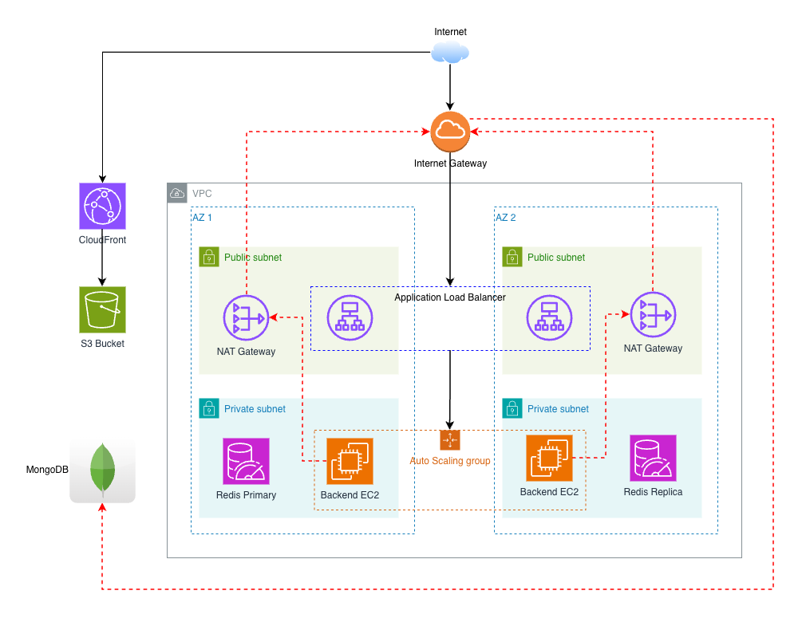

# StartTech Architecture

## System Overview



## Components

### Frontend (React)

| Component | Service | Purpose |
|-----------|---------|---------|
| Storage | S3 | Static file hosting |
| CDN | CloudFront | Global content delivery, HTTPS |
| Origin Access | OAC | Secure S3 access |

### Backend (Golang API)

| Component | Service | Purpose |
|-----------|---------|---------|
| Compute | EC2 (t2.micro) | Application servers |
| Scaling | Auto Scaling Group | Automatic capacity management |
| Load Balancing | ALB | Traffic distribution, health checks |
| Container | Docker | Application packaging |

### Data Layer

| Component | Service | Purpose |
|-----------|---------|---------|
| Cache | ElastiCache Redis | Session storage, caching |
| Database | MongoDB Atlas | Persistent data storage |

### Networking

| Component | CIDR | Purpose |
|-----------|------|---------|
| VPC | 10.0.0.0/16 | Isolated network |
| Public Subnets | 10.0.1.0/24, 10.0.2.0/24 | ALB, NAT Gateway |
| Private Subnets | 10.0.3.0/24, 10.0.4.0/24 | EC2, Redis |

### Security

| Component | Purpose |
|-----------|---------|
| ALB Security Group | Allow HTTP/HTTPS from internet |
| Backend Security Group | Allow app port from ALB only |
| Redis Security Group | Allow 6379 from backend only |
| IAM Roles | EC2 access to CloudWatch, SSM |

## Data Flow

### User Request (Frontend)

1. User requests `https://cloudfront-domain.net`
2. CloudFront serves cached content or fetches from S3
3. React app loads in browser

### API Request (Backend)

1. Frontend calls `http://alb-dns/api/endpoint`
2. ALB routes to healthy EC2 instance
3. Golang API processes request
4. Redis checked for cached data
5. MongoDB queried if cache miss
6. Response returned through ALB

## Deployment Flow

### Infrastructure (Terraform)

```
Push to main → GitHub Actions → terraform plan → terraform apply → Set secrets in app repo
```

### Application (Docker)

```
Push to full-stack → Build & Test → Docker build → Push to Hub → ASG Instance Refresh
```

## Scaling

### Auto Scaling Policies

| Metric | Threshold | Action |
|--------|-----------|--------|
| CPU > 70% | 2 periods | Scale up (+1 instance) |
| CPU < 30% | 2 periods | Scale down (-1 instance) |

### Capacity

| Setting | Value |
|---------|-------|
| Minimum | 2 instances |
| Maximum | 2 instances |
| Desired | 2 instances |

## High Availability

- **Multi-AZ**: Resources spread across 2 availability zones
- **ALB**: Distributes traffic across healthy instances
- **ASG**: Replaces unhealthy instances automatically
- **Redis**: Multi-AZ with automatic failover

## Monitoring

- **CloudWatch Logs**: Application logs from EC2 instances
- **CloudWatch Alarms**: CPU, ALB health, target group health
- **Health Checks**: ALB checks `/health` endpoint every 30s
